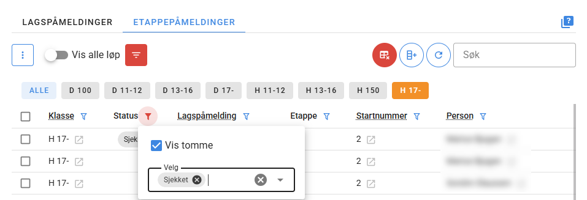

# Stafett

Time4o har støtte for ulike stafettkonsepter og følger i prinsipp modellen i IOF XML 3.0 med mulighet for blant annet parallelletapper.

Time4o kan importere etappeoppsett, påmeldinger og lagoppstillinger fra Eventor, og eksportere startliste og resultatliste til Eventor.

Det er også mulig å gjenbruke en brikke på flere etapper.

::: warning Obs!
Iom. at stafett-støtten fortsatt er fersk vil Time4o gjerne være delaktig når stafett arrangeres.
Ta kontakt om du ønsker å arrangere stafett i Time4o.
:::

Under følger en oversikt over oppsettet til stafett med utgangspunkt i at arrangementet importeres fra Eventor.

## Opprette arrangement

Importer arrangementet fra Eventor. 
   - Løpet vil automatisk bli satt opp med konkurransetype ***stafett*** og starttype ***fellesstart*** 
   - ***Kilde starttid*** blir dessuten satt til ***tidtaking***, noe som er riktig for alle etapper bortsett fra 1. etappe 
   som automatisk bruker ***startliste*** som i praksis er første start for klassen.
   - ***Kilde starttid mellomtid*** skal alltid være ***startliste***. Alle mellomtider beregnes fra klassens starttid.

## Stasjoner

Opprett to nye stasjoner (dette vil i framtiden skje automatisk)

1. Stasjon med stasjonstype ***stafettveksling***. Velg typer ***starttid*** og ***status***. 
   Prioritet løpsstasjon kan være ***12*** og prioritet data ***bruk første data***
2. Stasjon med stasjonstype ***stafettomstart***. Velg typer ***starttid*** og ***status***.
  Prioritet løpsstasjon kan være ***11*** og prioritet data ***bruk siste data***

### Avlesingsstasjoner

Avlesingsstasjonen må tilpasses slik at den **KUN** leverer tidtakingsdata med type ***Måltid***, ***Strekktid*** og ***Status***.

(Hvis den leverer ***Starttid*** så vil det gi feil etappetider.) 

### Mållinjestasjon

Ved bruk av stasjon på mållinja som ETS så skal stasjonen settes opp med  

### Mellomtidsstasjoner

Mellomtidsstasjoner skal **KUN** levere mellomtid.

(Hvis den leverer ***Starttid*** så vil det gi feil etappetider.)

## Klasser

Ved stafett vises Etappe-fanen på klasse. Etappe-oppsette importeres fra Eventor, men kan også settes opp manuelt i Time4o hvis Eventor ikke benyttes.

## Påmeldinger

I stafett er påmeldinger delt opp i lagspåmeldinger og etappepåmeldinger. Etappepåmeldingene er knyttet mot en lagspåmelding

- Etappepåmeldinger er i prinsipp det samme som påmeldinger i individuelle løp, og innholder tidtakingsdataene. 

- Lagspåmelding inneholder informasjon om navnet på laget, startnummer og hvilken klubber(er) det tilhører.

### Opprette lagspåmelding

Det enkleste er at alle lag melder seg på via Eventor, men det er også mulig å gjøre det direkte i Time4o.
Det må i såfall opprettes en lagspåmelding. Etappepåmeldingene opprettes automatisk basert på klasseoppsettet når det opprettes en lagspåmelding, 
og det er svært sjelden disse skal oppretts manuelt

Etappepåmeldingene er naturligvis uten løpernavn (personer), så når laget er klar må personene legges inn på hver etappe. 
Her kan man søke i Eventor-registerert tilsvarende individuelle løp.

## Starter (startnummer og gaflinger)

I stafett er ***starter*** delt opp i lagstarter og etappestarter. Etappestartene er knyttet mot en lagstart.
Når påmeldt lag skal tildeles et startnummer så kobles en lagstart mot lagets lagspåmelding, og tilhørende etappestarter mot hver sin etappepåmelding.

- Etappestarten angir i hovedsak gaflingen til etappen.
- Lagstarten angir kun startnummeret til laget

Hvis en klasse har 4 etapper skal hver lagstart bestå av 4 etappestarter.

### Opprette lagstarter

Den enkleste metoden for å opprette lagstarter er å sette opp startnummerserier og gaflinger i løypeleggerprogrammet og så importere dette i Time4o.
Når løypene importeres så må det hukes av for ***Opprett lagsstarter***. 

OCAD legger all nødvendig informasjon i IOF XML 3.0 fila slik at de kun er den ene fila som skal importeres for å både få på plass løyper og startnummer.
I andre løypeleggerprogram kan det være at informasjonen om startnummer ligger i egen fil. Pr. nå er ikke støtte for å importere denne på plass, men det er mulig å manuelt slå sammen de to filene.
Ta kontakt med Time4o for bistand. 

Alternativt kan lagstarter opprettes ved å importere en excel-fil via oppgaven [Opprett starter](/nb/tasks/create-starts).

[Eksempelfil for import av startnummer og gaflinger](https://docs.google.com/spreadsheets/d/11mMvqZJuSFdrZlcbW_7OH6YLKY4FzwAk/edit?usp=sharing&ouid=115982326307907416767&rtpof=true&sd=true)

I begge tilfeller bør antall startnummer beregnes i forhold til antall kart som skal trykkes. 
Eventuelt opprett nok, og rydd vekk overflødige lagstarter fra Time4o når antall trykte kart er bestemt.

### Tildele lagstarter

En lagspåmelding må tildeles en lagstart for å gi laget et startnummer og etappene en gafling.

Dette kan gjøres manuelt eller ved hjelp av oppgaven ***Tildel starter*** som tildeler lagstarter og etappestarter til lagspåmeldinger og etappepåmeldinger.

Tildeling kan gjøres via trekking (tilfeldig rekkefølge), seeding og seedinggrupper med trekking, eller alfabetisk rekkefølge.

## Tidtaking

## Omstart

Time4o støtter ubegrenset antall omstarter. 
En omstart settes per løper og er i prinsipp kun en ny starttid som vil overstyre starttiden fra vekslingen. (Omstartsstasjonen har bedre prioritet enn vekslingsstasjonen)

Heldivis er det enkelt å sette omstart på flere løpere av gangen. 

1. Gå til ***Påmeldinger*** > ***Etappepåmeldinger***
2. Bruk kolonnefiltrene eller søk for å finne løperne som gikk ut i omstart.
   - Filtrer ***Status*** med valget ***Vis tomme***, samt status ***Sjekket*** hvis det brukes brikkesjekk. Listen vil nå vise alle som ikke har startet i stafetten.
   - Hvis omstarten gjelder bestemt klasse eller etappe så må det filtreres på dette i tillegg.
   - Alternativt kan man søke på startnummer. Søk på flere startnummer separert med komma (eks. 121,135,175)

3. Startmannskapet bør notere startnummer på de som har gått ut i omstart, og du bør avstemme disse startnumrene mot listen du har i Time4o. Hvis man venter med å sette omstarten kan lag ha "vekslet" etter omstarten gikk og løperen som gikk ut i omstarten har rukket å få status ***Startet***, og dermed ikke vises.
4. Marker alle etappepåmeldingen som gikk ut i omstart, og velg radhandlingen ***Opprett stafettomstart*** fra menyen. Sett riktig starttid og trykk ***OK***

## Meldeposter

Meldepostoppsett vil ikke alltid overføres automatisk til liveresultater. 
Kjør derfor oppgaven ***Center: Synk løp- og klassedata*** med valget ***Full synk*** for å tvinge over meldepostoppsettet.

## Samme brikke på flere etapper

Time4o støtter også at samme brikke kan brukes på flere etapper i stafetten. 
