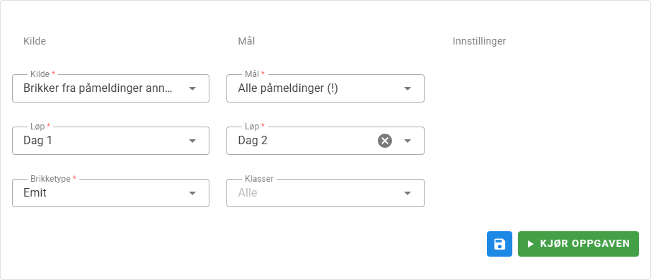

# {{ $frontmatter.title }}

### Beskrivelse

Denne oppgaven kan tildele ledige leiebrikker, eller tildele brikker som er brukt i et annet løp i samme eller annet arrangement.

Brikkene kan tildeles påmeldinger uten brikke, eller til alle påmeldinger.

::: warning OBS!
Hvis ***Mål*** er ***Alle påmeldinger*** så vil påmeldinger som allerede har brikke få tildelt ny brikke.
:::

Oppgaven kan [tidsstyres](/nb/tasks#schedules).

## Tildeling av leiebrikker

På forhånd må leiebrikkene være opprettet slik at de er tilgjengelige i brikkeregisteret.
Se oppgaven [Importer brikker](/nb/tasks/import-cards) for å importere brikker fra fil eller ved avlesing på en stasjon.

***Kilde*** skal være ***Ledige leiebrikker***.

De ledige leiebrikker tildeles etter brikkenummer i stigende rekkefølge, og påmeldingene sorteres etter klubb og starttid slik at det er enklere å pakke leiebrikkene klubbvis hvis det er ønsket.

## Tildele brikker fra annet løp

I et arrangement med flere løp kan det være nyttig å kunne tildele brikker fra tidligere løp/etapper slik at man får med seg brikkeendringer fra dag til dag.

Oppgaven sjekker om personen har en påmeldingen i kilde-løpet og overfører i såfall brikken til mål-løpet.

***Kilde*** skal være ***Brikker fra påmeldinger annet løp*** og ***Løp*** skal være løpet brikken skal hentes fra.

Hvis alle brikkeendringer skal overføres så må ***Mål*** være ***Alle påmeldinger***

## Tildele brikker fra annet arrangment

Denne varianten henter også brikker for annet løp, men løpet kan ligge i et annet arrangement.
For å matche personer på tvers av arrangementer så benyttes personens personidentfikator.
I de tilfeller Eventor benyttes er dette personens Eventor ID.

I tillegg så må brikkene ha brikketype med samme navn både i kilde og mål-arrangementet.

***Kilde*** skal være ***Brikker fra påmeldinger annet arrangement*** og ***Arrangement*** og ***Løp*** skal være arrangementet og løpet brikken skal hentes fra.

## Tildele til flere løp

Hvis arrangementet inneholder flere løp er det mulig å tildele brikker til flere løp i en operasjon ved å velge flere løp i ***Løp***-feltet under ***Mål***.

Hvis det er skal tildeles leiebrikker er det også mulig å velge ***Tildel samme brikke til påmelding med samme person*** slik at en person har samme leiebrikke i alle løp.

## Utskrift av leiebrikker

Bruk oppgaven for å skrive ut [startliste](/nb/tasks/start-list) hvis du trenger en liste over leiebrikker. Velg **Vis kun leiebrikker** og velg ønsket gruppering, sortering etc.

## Tips!

I arrangement med flere løp kan det være nyttig å kjøre oppgaven mellom hvert løp med følgende innstillinger for å overføre alle brikkeendringer til neste løp.

## Innstillinger

### Kilde

| Innstilling                  | Beskrivelse                                     |
|------------------------------|-------------------------------------------------|
| Kilde                        | Hvor skal brikker hentes fra.                   |
| Arrangement og løp | Arrangement og løp det skal hentes brikker fra. |
| Brikketype                   | Hent brikker med valgt brikketype.              |

### Mål

| Innstilling                                          | Beskrivelse                                                                                                                                                                                  |
|------------------------------------------------------|----------------------------------------------------------------------------------------------------------------------------------------------------------------------------------------------|
| Mål                                                  | Hvilke påmeldinger skal tildeles brikke til.                                                                                                                                                 |
| Løp                                                  | Løp det skal tildeles brikker.                                                                                                                                                               |
| Tildel samme brikke til påmeldinger med samme person | Benyttes i flerdagersarrangement der en person skal ha samme leiebrikke alle dager, samt stafetter der samme deltager løper flere etapper.                                                   |
| Ikke tildel til påmeldinger uten person              | Benyttes i stafetter hvis man vil tildele leiebrikker før alle lagoppstillinger er levert. Dette valget unngår at man tildeler leiebrikke til etapper som ikke har levert lagoppstilling. |

