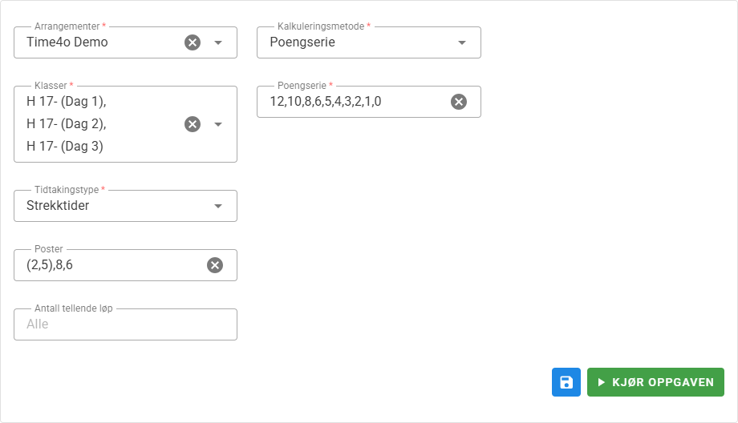

# {{ $frontmatter.title }}  ({{ $frontmatter.job }})

### Beskrivelse

Denne oppgaven kan generere poengstillinger basert på strekktider eller sluttider på tvers av arrangement og klasser.
Oppgaven genererer en rapport (JSON-fil) som Time4o Center kan hente inn og presentere.

## Oppsett

Det må opprettes en oppgave per klasse man ønsker å vise en poengstilling for. 

1. Opprett oppgaven med passende navn. Navnet på oppgaven vises som overskrift i Time4o Center.
2. Velg arrangementer og klasser som skal være med i beregning. Alle klasser på tvers av alle valgte arrangmenter vises, så søking er anbefalt for å finne ønskede klasser.
3. Sett innstillinger (se beskrivelse lenger ned)
4. Legg til delingslink på oppgaven.
5. Opprett en side i Time4o Center med sidetype ***Rapport*** og lim inn delingslinken i feltet ***Lenke***.

## Generering av rapport

Oppgaven må kjøres for at Time4o Center skal vises siste versjon av poengstillingen. Det er tre måter å generere rapporten på

- A) Kjøre oppgaven manuelt (typisk etter at løpet er ferdig).
- B) Kjøre oppgaven automatisk med jevne mellomrom ved hjelp av tidsplan (typisk under løpet)
- C) Aktiver ***Kjør oppgave*** på delingslinken, noe som gjør at rapporten genereres automatisk på nytt hver gang noen besøker siden i Time4o Center, gjerne med en caching på 5 minutter.

Alternativ A og B er raskest og anbefalt ved mange deltagere og mange besøk i Time4o Center

Alternativ C er enklere da man slipper å generere rapporten på nytt hvis resultatene endrer seg. Siden i Time4o Center blir derimot litt tregere da oppgaven kjøres hver gang noen besøker siden.

## Eksempel

I eksempelet under skal det beregnes en poengstilling basert på strekktider i H 17- i et 3-dagersløp. 
- I det første løpet (Dag 1) skal strekktid 2 og 5 være med i beregning (omgitt av paranteser).
- I det andre løpet (Dag 2) skal strekktid 8 være med i beregning. 
- I det siste løpet (Dag 3) skal strekktid 6 være med i beregning.

Deltageren med beste strekktid får 12 poeng, nest beste strekktid 10 poeng osv. Alle deltagere med strekktidsplassering 10 eller dårligere får 0 poeng.

Her er et eksempel på poengtrøyer i Østfold sin Ungdomsserie

https://center.time4o.com/OOK/ungdomsserien-2026/spurttroye

## Innstillinger

| Innstilling                       | Beskrivelse                                                                                                                                                                                                                                                |
|-----------------------------------|------------------------------------------------------------------------------------------------------------------------------------------------------------------------------------------------------------------------------------------------------------|
| Løp/klasse                        | Løpet/klassene det skal hentes strekktider eller sluttider fra                                                                                                                                                                                             |
| Tidtakingstype                    | Skal poeng beregnes fra strekktider eller sluttid                                                                                                                                                                                                          |
| Poster                            | Kommaseparert liste med postnummer som skal brukes. Dvs. om strekk fra post 3 til post 4 skal benyttes, så oppgis 4. Hvis ingenting oppgis brukes strekktiden til mål (spurtstrekk). For å bruke flere poster fra samme klasse, oppgi disse i en parantes. |
| Antall tellende løp               | Antall tellende poeng som brukes for å beregne totalpoeng.                                                                                                                                                                                                 |
| Kalkuleringsmetode                | Poengserie eller poengfratrekk                                                                                                                                                                                                                             |
| Poengserie                        | Kommaseparert liste med poeng der finner får første verdi. Alle som har fullført strekket får siste verdi i serien, så husk ev. 0 til slutt.                                                                                                               |
| Vinnerpoeng (Poengfratekk)        | Poeng til vinneren                                                                                                                                                                                                                                         |
| Sekunder per poeng (Poengfratekk) | Hvor mange sekunder bak vinner skal deltager være for å få ett poeng fratrekk                                                                                                                                                                              |
| Avrunging poeng (Poengfratekk)    | Avrundingsregler er aktuelt hvis innstillingen ***Sekunder per poeng*** er større enn 1.                                                                                                                                                                   |

